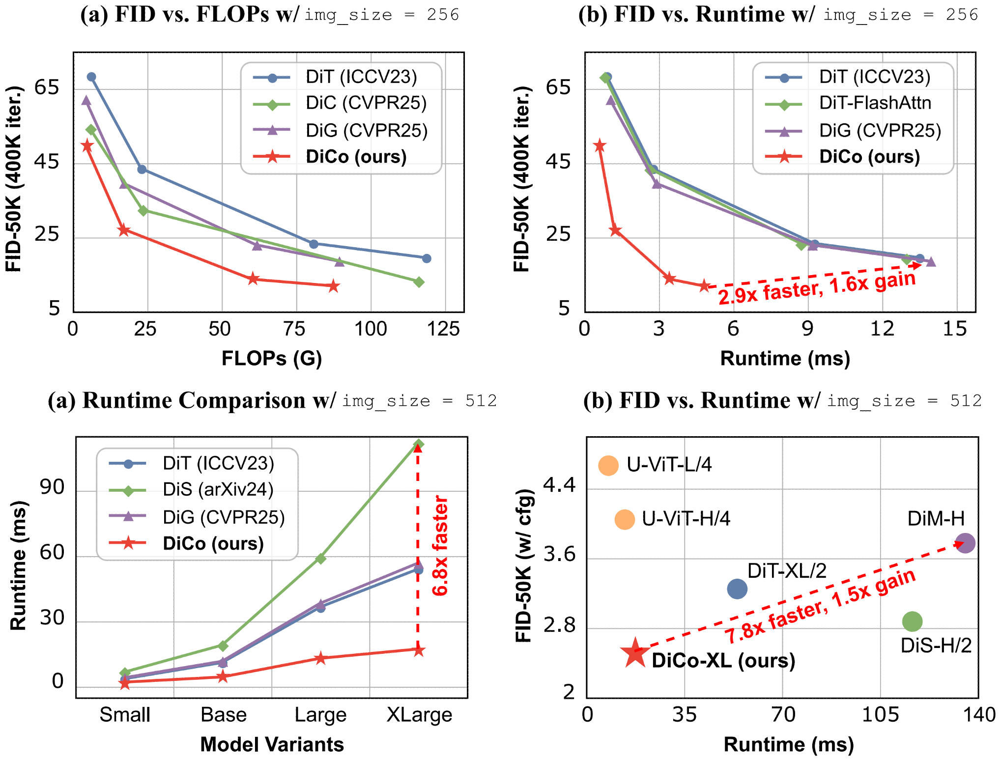

<div align="center">

<div class="logo">
      
   </a>
</div>

<h1>DiCo: Revitalizing ConvNets for Scalable and Efficient Diffusion Modeling</h1>

<div>
    <a href='https://scholar.google.com/citations?user=2Qp7Y5kAAAAJ' target='_blank'>Yuang Ai</a><sup>1,2</sup>&emsp;
    <a href='https://scholar.google.com/citations?user=9HGN_c0AAAAJ&hl' target='_blank'>Qihang Fan</a><sup>1,2</sup>&emsp;
    <a href='https://scholar.google.com/citations?user=Ee616UkAAAAJ' target='_blank'>Xuefeng Hu</a><sup>3</sup>&emsp;
    <a href='https://scholar.google.com/citations?user=Ds5wwRoAAAAJ' target='_blank'>Zhenheng Yang</a><sup>3</sup>&emsp;
    <a href='https://scholar.google.com/citations?user=ayrg9AUAAAAJ' target='_blank'>Ran He</a><sup>1,2</sup>&emsp;
    <a href='https://scholar.google.com/citations?user=XMvLciUAAAAJ' target='_blank'>Huaibo Huang</a><sup>1,2</sup>&emsp;
</div>
<div>
<sup>1</sup>CASIA&emsp;
<sup>2</sup>UCAS&emsp;
<sup>3</sup>ByteDance</div>
<div>
</div>
<div>
    <strong>NeurIPS 2025 Spotlight</strong>
</div>
<div>
    <em>Diffusion ConvNet is Stronger than you Think!</em>
</div>
<div>
    <h4 align="center">
        <a href="https://arxiv.org/abs/2505.11196" target='_blank'>
        
        </a>
        <a href="https://huggingface.co/shallowdream204/DiCo/" target='_blank'>
        
        </a>
        
    </h4>
</div>

⭐ If DiCo is helpful to your projects, please help star this repo. Thanks! 🤗



</div>

<be>


## 🔥 News
- **2025.9.19**: We release code, models and training logs of DiCo.
- **2025.9.18**: DiCo is accepted by NeurIPS 2025 as a spotlight paper! 🎉
- **2025.5.18**: This repo is created.


## 📷 Results 
Our DiCo models consistently require fewer Gflops compared to their Transformer counterparts, while achieving superior generative performance.
|    Model-iters     | Resolution| CFG | FID  | IS |Params | FLOPs |   ckpt     |   log     |
|:------------------:|:----------:|:-------:|:----:|:----:|:----:|:------:|:--------------------------------------------------------------------------------------:|:------:|
|   DiCo-S-400k   |  256x256   |  1.0  | 49.97 | 31.38  |33.1M| 4.25G  |   [ckpt](https://huggingface.co/shallowdream204/DiCo/blob/main/DiCo-S-400K-256x256.pt)   | [log](logs/log-dico-s-256x256.txt)
|   DiCo-B-400k   |  256x256   |  1.0  |27.20 | 56.52 |130.0M| 16.88G  |   [ckpt](https://huggingface.co/shallowdream204/DiCo/blob/main/DiCo-B-400K-256x256.pt)   | [log](logs/log-dico-b-256x256.txt)
|   DiCo-L-400k   |  256x256   |  1.0  |13.66 |91.37 |463.9M| 60.24G  |   [ckpt](https://huggingface.co/shallowdream204/DiCo/blob/main/DiCo-L-400K-256x256.pt)   | [log](logs/log-dico-l-256x256.txt)
|   DiCo-XL-400k   |  256x256   |  1.0  | 11.67 |100.42  |701.2M| 87.30G  |   [ckpt](https://huggingface.co/shallowdream204/DiCo/blob/main/DiCo-XL-400K-256x256.pt)   | [log](logs/log-dico-xl-256x256.txt)
|   DiCo-XL-3750k   |  256x256   |  1.4  |2.05 | 282.17  |701.2M| 87.30G  |   [ckpt](https://huggingface.co/shallowdream204/DiCo/blob/main/DiCo-XL-3750K-256x256.pt)   | [log](logs/log-dico-xl-256x256.txt)


## 🎰 Training
#### I - Prepare training data
Similar to [fast-DiT](https://github.com/chuanyangjin/fast-DiT), we use VAE to extract ImageNet features before starting training:
```shell
torchrun --nnodes=1 --nproc_per_node=1 --master_port=1234 extract_features.py \
    --model DiT-XL/2 \
    --data-path /path/to/imagenet/train \
    --features-path /path/to/store/features
```
#### II - Training for DiCo
To launch DiCo-XL (256x256) training with `8` GPUs on `1` node:
```shell
export WANDB_API_KEY='YOUR_WANDB_API_KEY'
accelerate launch \
    --multi_gpu \
    --num_processes=8 \
    --main_process_port=1234 \
    --mixed_precision=no \
    train_accelerate.py \
    --feature-path=/path/to/store/features \
    --image-size=256 \
    --model-domain=dico \
    --model=DiCo-XL\
    --results-dir=/path/to/store/exp/results \
    --exp-name=DiCo-XL-256
```
To launch DiCo-XL (256x256) training with `32` GPUs on `4` nodes:
```shell
export WANDB_API_KEY='YOUR_WANDB_API_KEY'
accelerate launch \
    --multi_gpu \
    --num_processes=32 \
    --num_machines=4 \
    --main_process_ip=... \
    --main_process_port=1234 \
    --machine_rank=... \
    --mixed_precision=no \
    train_accelerate.py \
    --feature-path=/path/to/store/features \
    --image-size=256 \
    --model-domain=dico \
    --model=DiCo-XL \
    --results-dir=/path/to/store/exp/results \
    --exp-name=DiCo-XL-256
```

## ⚡ Evaluation (FID, Inception Score, etc.)
To sample 50K images from our pre-trained DiCo-XL (400K iters, w/o cfg, FID=11.67) model over `8` GPUs, run:

```shell
torchrun --nnodes=1 --nproc_per_node=8 --master-port=1234 \
    sample_ddp.py \
    --ckpt=/path/to/DiCo-XL-400K-256x256.pt \
    --image-size=256 \
    --model=DiCo-XL \
    --model-domain=dico \
    --cfg-scale=1.0 \
    --global-seed=1234
```
To sample 50K images from our pre-trained DiCo-XL (3750K iters, w/ cfg=1.4, FID=2.05) model over `8` GPUs, run:

```shell
torchrun --nnodes=1 --nproc_per_node=8 --master-port=1234 \
    sample_ddp.py \
    --ckpt=/path/to/DiCo-XL-3750K-256x256.pt \
    --image-size=256 \
    --model=DiCo-XL \
    --model-domain=dico \
    --cfg-scale=1.4 \
    --global-seed=1234
```

These scripts generate a folder of samples as well as a `.npz` file which can be directly used with [ADM's TensorFlow evaluation suite](https://github.com/openai/guided-diffusion/tree/main/evaluations) to compute FID, Inception Score and other metrics.

## 🪪 License

The provided code and pre-trained weights are licensed under the [Apache 2.0 license](LICENSE).

## 🤗 Acknowledgement

This code is based on [DiT](https://github.com/facebookresearch/DiT), [fast-DiT](https://github.com/chuanyangjin/fast-DiT) and [U-DiT](https://github.com/YuchuanTian/U-DiT). We thank the authors for their awesome work.


## 📧 Contact
If you have any questions, please feel free to reach me out at shallowdream555@gmail.com. 

## 📖 Citation
If you find our work useful for your research, please consider citing our paper:
```
@article{ai2025dico,
    title={DiCo: Revitalizing ConvNets for Scalable and Efficient Diffusion Modeling},
    author={Ai, Yuang and Fan, Qihang and Hu, Xuefeng and Yang, Zhenheng and He, Ran and Huang, Huaibo},
    journal={arXiv preprint arXiv:2505.11196},
    year={2025}
}
```