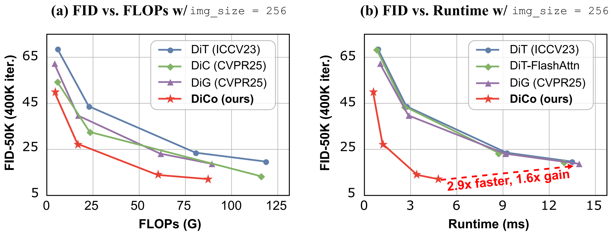
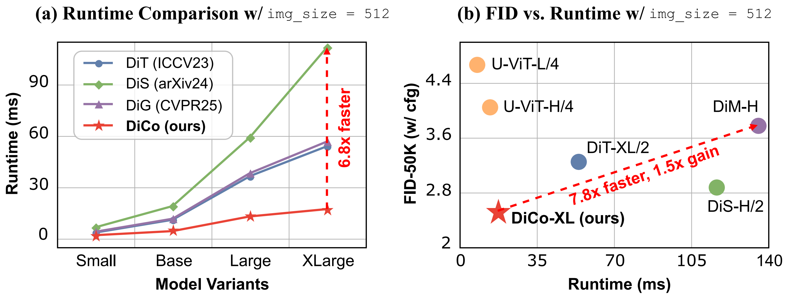

<div align="center">

<div class="logo">
      
   </a>
</div>

<h1>DiCo: Revitalizing ConvNets for Scalable and Efficient Diffusion Modeling</h1>

<div>
    <a href='https://scholar.google.com/citations?user=2Qp7Y5kAAAAJ' target='_blank'>Yuang Ai</a><sup>1,2</sup>&emsp;
    <a href='https://scholar.google.com/citations?user=9HGN_c0AAAAJ&hl' target='_blank'>Qihang Fan</a><sup>1,2</sup>&emsp;
    <a href='https://scholar.google.com/citations?user=Ee616UkAAAAJ' target='_blank'>Xuefeng Hu</a><sup>3</sup>&emsp;
    <a href='https://scholar.google.com/citations?user=Ds5wwRoAAAAJ' target='_blank'>Zhenheng Yang</a><sup>3</sup>&emsp;
    <a href='https://scholar.google.com/citations?user=ayrg9AUAAAAJ' target='_blank'>Ran He</a><sup>1,2</sup>&emsp;
    <a href='https://scholar.google.com/citations?user=XMvLciUAAAAJ' target='_blank'>Huaibo Huang</a><sup>1,2</sup>&emsp;
</div>
<div>
<sup>1</sup>CASIA&emsp;
<sup>2</sup>UCAS&emsp;
<sup>3</sup>ByteDance</div>
<div>
</div>
<div>
    <strong>arXiv 2025</strong>
</div>
<div>
    <strong><em>Diffusion ConvNet is Stronger than you Think!</em></strong>
</div>
<div>
    <h4 align="center">
        <a href="https://arxiv.org/abs/2505.11196" target='_blank'>
        
        </a>
        <a href="https://huggingface.co/shallowdream204/DiCo/" target='_blank'>
        
        </a>
        
    </h4>
</div>

⭐ If DiCo is helpful to your projects, please help star this repo. Thanks! 🤗





</div>

<be>


## 🔥 News
- **2025.5.18**: This repo is created.


## 📧 Contact
If you have any questions, please feel free to reach me out at shallowdream555@gmail.com. 

## 📖 Citation
If you find our work useful for your research, please consider citing our paper:
```
@article{ai2025dico,
    title={DiCo: Revitalizing ConvNets for Scalable and Efficient Diffusion Modeling},
    author={Ai, Yuang and Fan, Qihang and Hu, Xuefeng and Yang, Zhenheng and He, Ran and Huang, Huaibo},
    journal={arXiv preprint arXiv:2505.11196},
    year={2025}
}
```